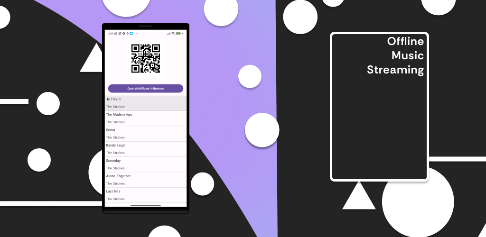

# Music Server

It lets you create a simplistic, fast, light home server for your music media.



# WEB PLAYER

The desktop and Android builds automatically bundle the **latest** web player
released at [github.com/wwwjsw/musicclient/releases](https://github.com/wwwjsw/musicclient/releases).
A `fetchWebPlayer` Gradle task runs on every build and, when a new release
exists, updates the bundled player files:

- `desktop/src/desktopMain/resources/music.zip`
- `app/src/main/res/raw/music.zip`

```bash
# Refresh the bundled web player manually
./gradlew fetchWebPlayer

# Pin a specific release version
./gradlew fetchWebPlayer -PwebPlayerVersion=v0.1.5

# GitHub API token (avoids the 60 req/h rate limit)
./gradlew fetchWebPlayer -PgithubToken=<token>   # or export GITHUB_TOKEN
```

Offline builds keep using the last bundled player (a warning is printed). The
two `music.zip` files are committed as the offline seed; commit them again
whenever a new web player version is bundled.

# ROADMAP, FEATURE REQUESTS AND ISSUES
## Was moved to [_here_](https://github.com/wwwjsw/MusicServer/issues)