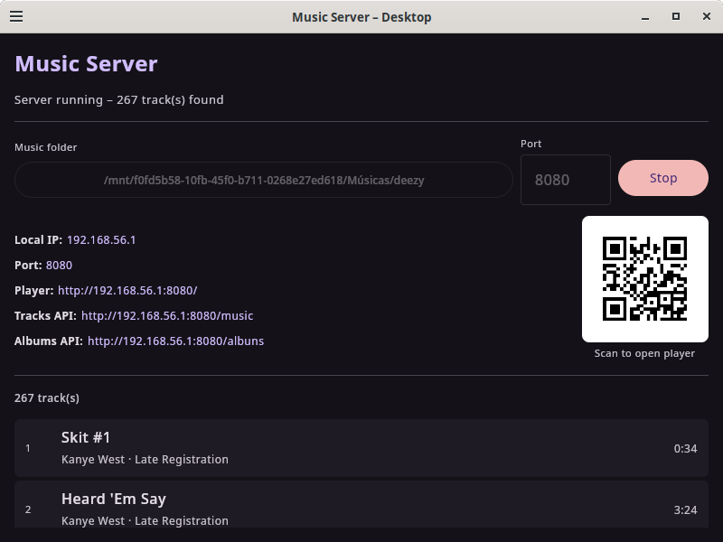

# Music Server – Desktop (Linux)

Linux/Desktop port of the Music Server Android app, implemented via
**Kotlin Multiplatform** + **Compose Desktop** + **Ktor 3.x**.



## Features

- Dark-themed Compose Desktop UI with folder picker, port control, and Start/Stop button
- Scans any local folder recursively for audio files (`mp3`, `flac`, `ogg`, `m4a`, `aac`, `wav`, `opus`, `wma`)
- Supports external drives and any path (including `/mnt`, `/media`)
- Reads ID3 / FLAC / OGG / M4A tags via **JAudioTagger** (title, artist, album, duration, artwork)
- Parallel scan using a thread pool sized to available CPUs — results cached in memory
- Skips `WhatsApp Audio`, `WhatsApp Voice Notes`, and `Telegram Audio` folders
- HTTP server via **Ktor + Netty** with HTTP Range support for seekable streaming
- Embedded web player served from bundled `music.zip` — open in any browser on the same network
- QR code to open the player instantly on your phone
- Live track list displayed in the UI after scanning

## Requirements

| Tool | Version |
|---|---|
| JDK | 17 or newer |
| Gradle | via wrapper (`./gradlew`) |
| `fakeroot` | required for `.deb` packaging |
| `rpm` | required for `.rpm` packaging |

Install packaging deps on Ubuntu/Debian:
```bash
sudo apt install fakeroot rpm
```

## Running in development

```bash
chmod +x gradlew
./gradlew :desktop:run
```

## Web player

Builds automatically bundle the **latest** web player released at
<https://github.com/wwwjsw/musicclient/releases>. A `fetchWebPlayer` task runs
before the resources are processed and, when a new release exists, updates
`desktop/src/desktopMain/resources/music.zip` (and the Android copy). Run it
manually with `./gradlew fetchWebPlayer`; pin a version with
`-PwebPlayerVersion=<tag>` and authenticate against the GitHub API with
`-PgithubToken=<token>` or the `GITHUB_TOKEN` env var.

## Building a distributable

```bash
# Self-contained JAR (works on any Linux with JDK 17+)
./gradlew :desktop:packageUberJarForCurrentOS
java -jar desktop/build/compose/jars/MusicServer-linux-x64-*.jar

# Debian / Ubuntu .deb installer
./gradlew :desktop:packageDeb
# Output: desktop/build/compose/binaries/main/deb/

# RPM-based distros (Fedora, openSUSE)
./gradlew :desktop:packageRpm
# Output: desktop/build/compose/binaries/main/rpm/

# Portable AppImage (no install needed)
./gradlew :desktop:packageAppImage
# Output: desktop/build/compose/binaries/main/app/
```

## Android Studio run configurations

The project includes pre-configured run configurations under `.idea/runConfigurations/`:

| Name | Task |
|---|---|
| **Desktop Run** | `:desktop:run` |
| **Desktop Package JAR** | `:desktop:packageUberJarForCurrentOS` |
| **Desktop Package Deb** | `:desktop:packageDeb` |
| **Desktop Package AppImage** | `:desktop:packageAppImage` |

## API (same as Android)

| Endpoint | Description |
|---|---|
| `GET /` | Serves the embedded web player (`index.html` from `music.zip`) |
| `GET /js/app.js` | Web player JS |
| `GET /music` | JSON list of all tracks |
| `GET /music?audio_id=<id>` | Audio stream with HTTP Range support (seek-capable) |
| `GET /albuns` | JSON list of albums (name kept for API compatibility) |

## Module structure

```
desktop/
├── icon.png
├── screenshot.png
├── build.gradle.kts
└── src/desktopMain/kotlin/com/wwwjsw/musicserver/
    ├── Main.kt                       # Compose Desktop UI + directory picker + QR
    ├── models/
    │   ├── MusicTrack.kt             # JVM model (no Android Bitmap dependency)
    │   └── Album.kt
    ├── resources/
    │   └── music.zip                 # Bundled web player frontend
    └── server/
        ├── MusicScanner.kt           # Parallel filesystem walker + JAudioTagger + cache
        └── DesktopMediaServer.kt     # Ktor 3.x server (mirrors Android MediaServer)
```
